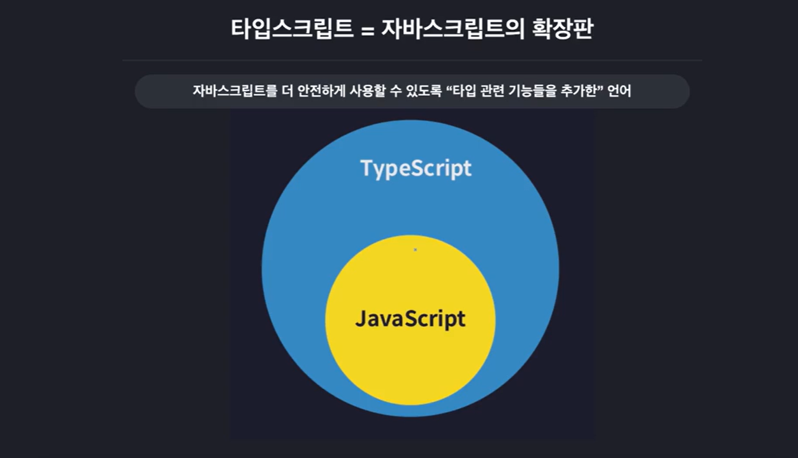
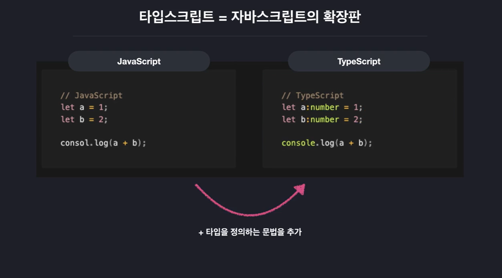
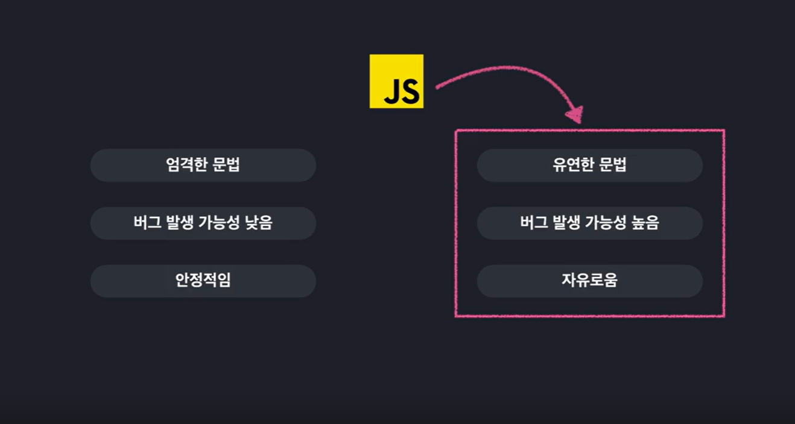
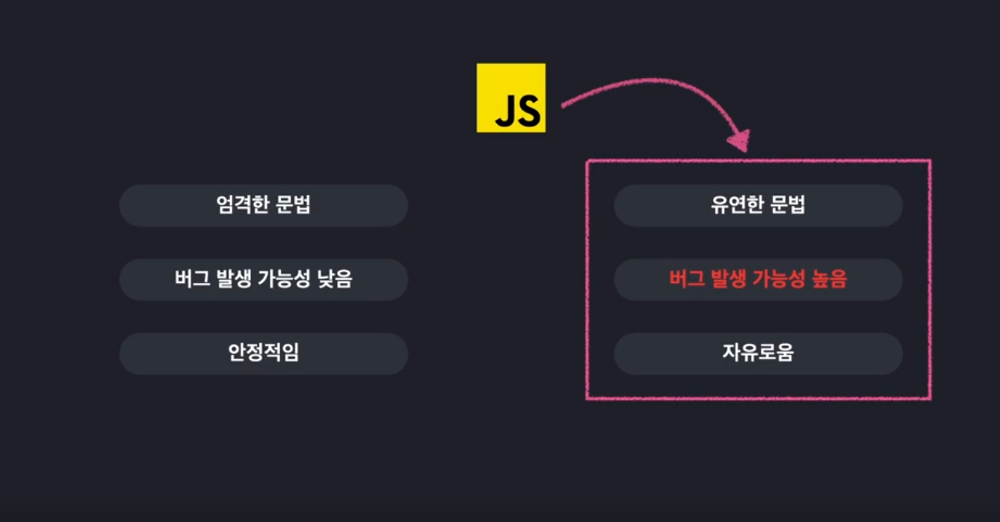

# TypeScript란?

### JavaScript의 확장판!

 

### Type을 정의하는 문법 추가

 

### JavaScript도도 잘나가는데 굳이 TypeScript가 필요할까?

> 타입스크립트 인기 좋은거 알겠고  
> 취업 시장에서 요구하는 것도 알겠고  
> 배우기 쉬운것도 알겠는데
>
> 굳이 나도 배워야 하는 걸까?

#### JavaScript는는 간단한 상호작용을 구현하기 위해 개발되었기 때문에, 아래와 같은 특징을 가진다.

#### 그러던 어느날 JavaScript 구동기인 Node.js 등장!

### JavaScript를 다양한 곳에 활용하다보니 유연한 문법에서 오는 버그 발생률이 문제가 되었다.

### 결론 : JavaScript를 더 안전하게 사용 할 수 있도록 "타입 관련 기능들을 추가한" 언어 TypeScript

 

