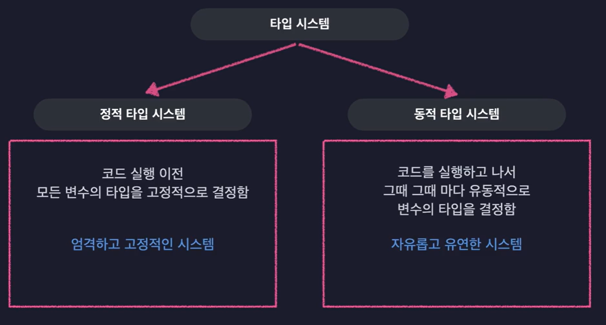
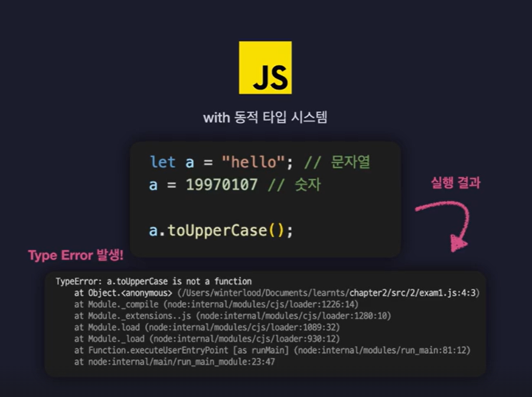

# JavaScript의 한계점과 TypeScript

시작하기에 앞서

### Type System이란?

 

### JavaScript는 동적 타입 시스템이며, 아무 타입의 값이나 자유롭게 담을 수 있음

#### 여기서 발생하는 문제

 

### 그래서 TypeScript는?

> 정적 타입 시스템과 동적 타입 시스템의 장점을 합침!

 

