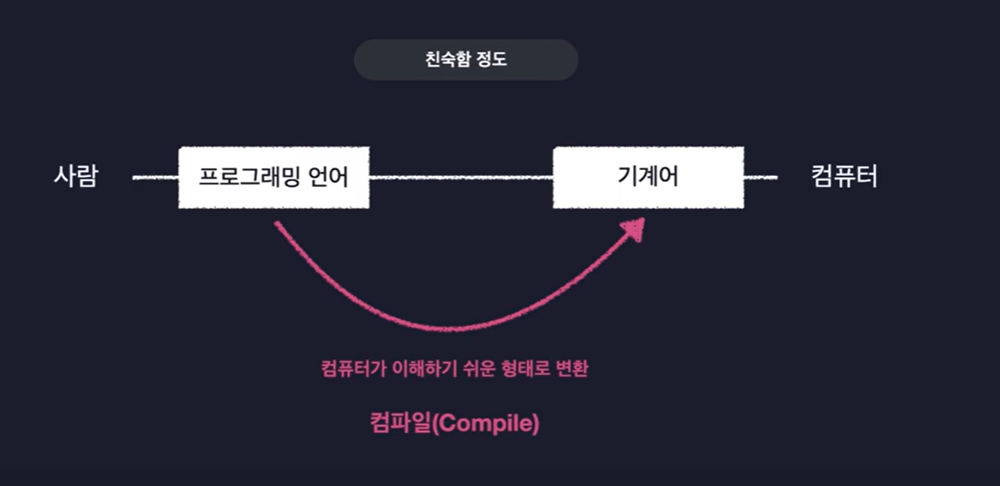
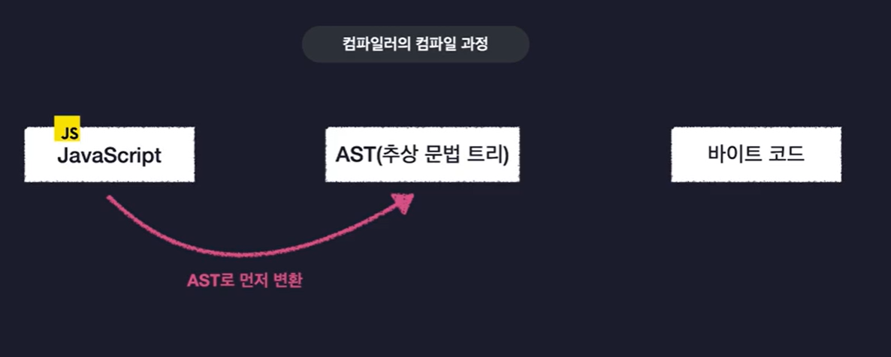
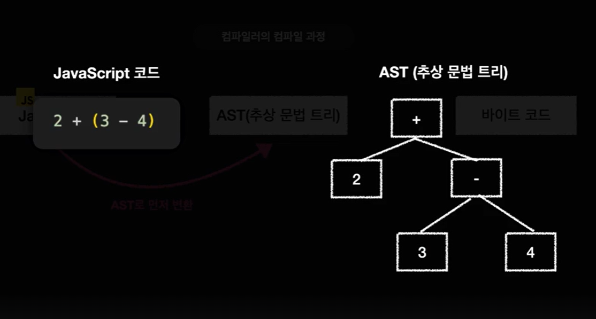
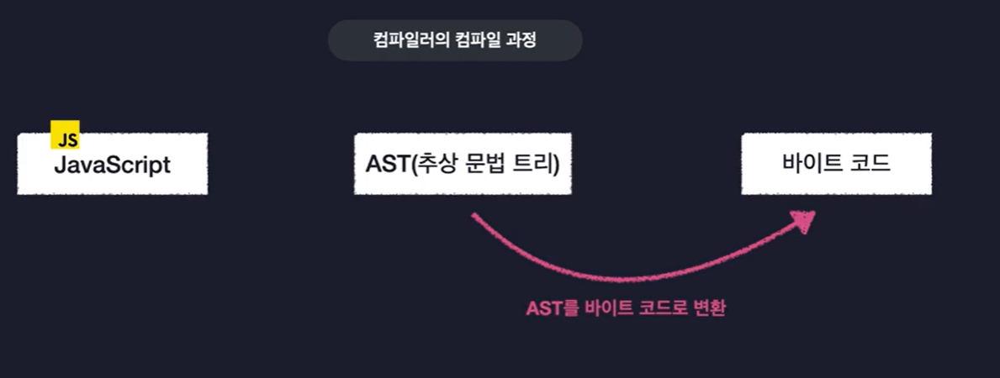
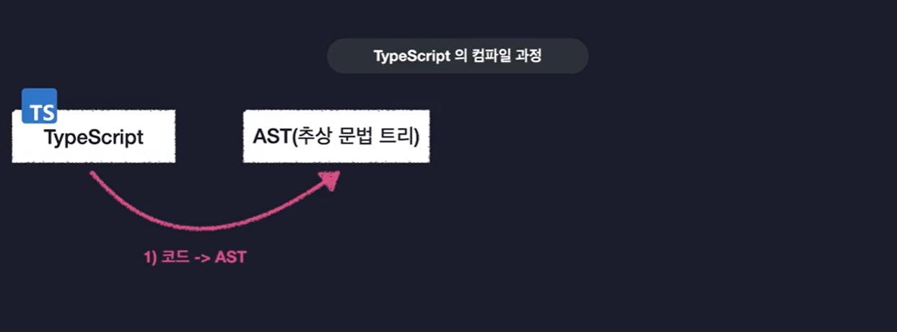
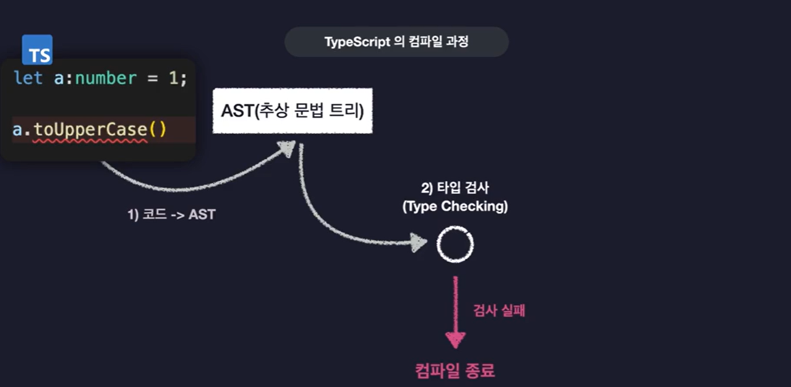
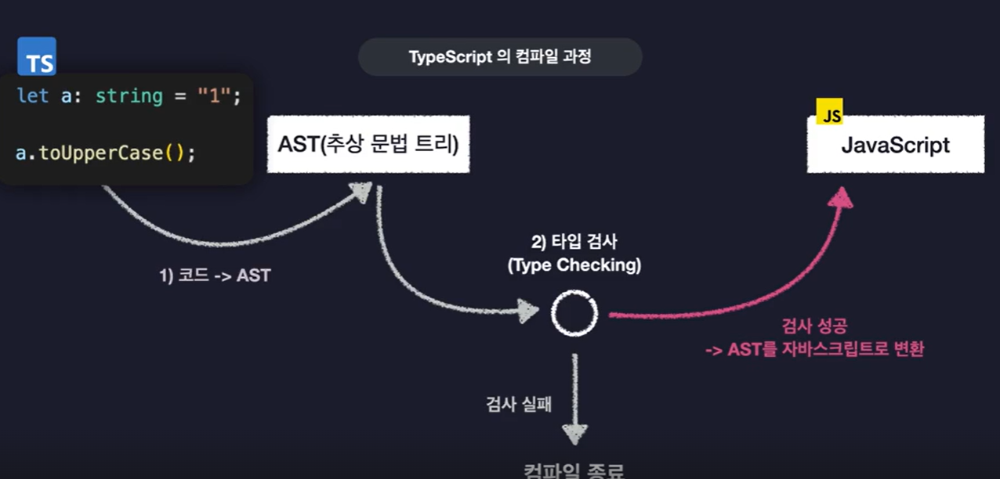
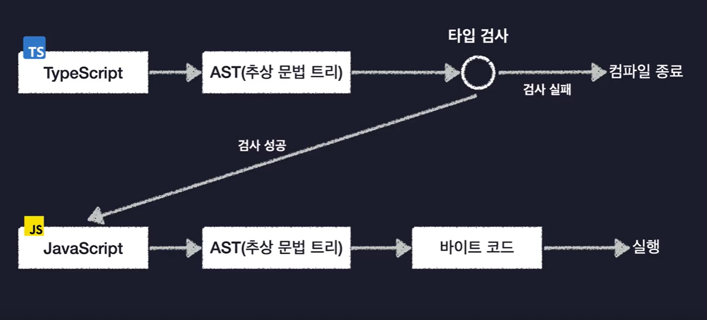

# TypeScript의 동작 원리

### 대다수의 프로그래밍 언어는 어떻게 동작할까?

> **참고**  
> 컴파일러 : 컴파일을 지원해주는 프로그램  
> 바이트코드 : 프로그래밍 언어가 컴파일 된 후 산출물

 

### 컴파일 과정

1. AST로 먼저 변환.
   

2. 코드의 공백이나 주석, Tab등의 실행에 관계없는 부분들을 전부 제거 한 후, 트리 형태의 자료구조에 쪼개서 저장함.
   

3. 바이트 코드로 변환
   

 

### TypeScript의 변환 과정

1. AST로 변환
   

2. Type Checking
   

3. 바이트 코드가 아닌 자바스크립트로 변환
   

4. 변환된 자바스크립트는 다시한번 컴파일 과정을 거침
   

> Type오류가 없기때문에 안전한 자바스크립트 바이트코드 완성!

 

